Final Project Submission

Please fill out:
* Student name: Sung Bae
* Student pace: online full time
* Scheduled project review date/time: 08/13/2020
* Instructor name: James Irving
* Blog post URL: 


# Introduction to the Project

## Introduction
Over the century, the film industry have been exponentially growing not only in the developed countries, but also developing countries as well making.


## Problem Statement
Microsoft sees all the big companies creating original video content, and they want to get in on the fun. They have decided to create a new movie studio, but the problem is they don’t know anything about creating movies. They have hired you to help them better understand the movie industry. Your team is charged with doing data analysis and creating a presentation that explores what ```type of films are currently doing the best at the box office```. You must then translate those findings into actionable insights that the CEO can use when deciding what type of films they should be creating.

### Defining the "best".
There are multiple ways to measure "best"ness of films but they boil down to is the film "profitable" financially and non-financially. So we will consider the following catergories:
* Return on investment (ROI)
    - Higher ROI in domestic revenue rather than international revenue.
    - "But generally, domestic revenue seems to be be better for studios than overseas revenue, because the studios take a bigger cut of domestic revenue." (https://io9.gizmodo.com/how-much-money-does-a-movie-need-to-make-to-be-profitab-5747305)
* Rating by non-critics
    - 
* Nominations film awards

### What makes a film company a "successful" film company in the industry?

## Data Set
You may scrape or make API calls to get additional data, but included in the repository (in the folder zippedData) is some movie-related data from:

* Box Office Mojo
* IMDB
* Rotten Tomatoes
* TheMovieDB.org


## 4 Questions to be answered
* Which Genre(s) produced highest rating?
* Which Genre(s) produced maximum ROI?
* How much money should be invested
* Which region of the world should be our focus target?

# EDA

## Importing and storing data

### Importing Libraries


```python
import pandas as pd
import glob
import matplotlib.pyplot as plt
import seaborn as sns
import sqlite3
import os
import scipy.stats as stats
%matplotlib inline
# Setting up font size for seaborn plots
sns.set(font_scale=1.7)
```


```python
%pwd
```


    '/Users/juhyunlee/Documents/GitHub/dsc-mod-1-project-v2-1-onl01-dtsc-ft-070620'


### Importing datasets into dataframe


```python
# importing given data form /zippeData directory
os.chdir("zippedData")

# import all files that matches the given extension 'gz':
extension = 'csv.gz'
all_filenames = [i for i in glob.glob('*.{}'.format(extension))]

#source: https://www.freecodecamp.org/news/how-to-combine-multiple-csv-files-with-8-lines-of-code-265183e0854/

```


```python
all_filenames
```


    ['imdb.title.crew.csv.gz',
     'tmdb.movies.csv.gz',
     'imdb.title.akas.csv.gz',
     'imdb.title.ratings.csv.gz',
     'imdb.name.basics.csv.gz',
     'imdb.title.basics.csv.gz',
     'tn.movie_budgets.csv.gz',
     'bom.movie_gross.csv.gz',
     'imdb.title.principals.csv.gz']


```python
# ## Cleaning 'title.principals.tsv.gz'
# df = pd.read_csv("title.basics.tsv.gz", delimiter="\t", encoding='utf-8')
# df['titleType'].value_counts()
# df_title_basics = df[df['titleType']=='movie']
```


```python
# # saving into csv files
# df_title_basics.to_csv('title_basics.csv')
```


```python
# ## Cleaning 'title.akas.tsv.gz'
# df = pd.read_csv("title.akas.tsv.gz", delimiter="\t", encoding='utf-8')
# df['types'].value_counts()
```


```python
df_list = []
for name in all_filenames:
    try: 
        df_list.append(pd.read_csv(f"{name}", index_col=0))
    except:
        print(name)
```


```python
len(df_list)
```


    9


```python
# Rename different dataframe
df_title_crew = df_list[0]
df_movies = df_list[1]
df_title_akas = df_list[2]
df_title_ratings = df_list[3]
df_names_basics = df_list[4]
df_title_basics = df_list[5]
df_movie_budgets = df_list[6]
df_movie_gross = df_list[7]
df_title_principals = df_list[8]
```

### Creating SQL database


```python
# Creates sqlite server
conn = sqlite3.connect('movies.db')
cursor = conn.cursor()

```


```python
# Saving dataframe to sql server
df_movie_budgets.to_sql('movieBudgets', if_exists='append', con=conn)
df_title_ratings.to_sql('titleRatings', if_exists='append', con=conn)
df_title_akas.to_sql('titleAkas', if_exists='append', con=conn)
df_title_basics.to_sql('titleBasics', if_exists='append', con=conn)
df_names_basics.to_sql('nameBasics', if_exists='append', con=conn)
df_title_principals.to_sql('titlePrincipals', if_exists='append', con=conn)
df_movie_gross.to_sql('movieGross', if_exists='append', con=conn)
df_movies.to_sql('movies', if_exists='append', con=conn)
df_title_crew.to_sql('titleCrew', if_exists='append', con=conn)
```


The above figure shows how each tables are set.


```python
# query ="""
# SELECT *
# FROM movies
# """
# pd.read_sql_query(query, conn)
```

Now all the data are in sqlite database and ready to be used!

## Cleaning Data

### Cleaning Data - Introduction


```python
# seaborn style settings
fig, ax = plt.subplots(figsize=(12,8))
sns.set_style("whitegrid")
sns.distplot(df_movie_budgets['year'], ax=ax, 
             color='b',
             kde_kws={'color':'r'});
ax.set(xlabel='Year', ylabel='Fraction', 
       title=f'Fraction of Films by Released Years (n={len(df_movie_budgets)})');
```


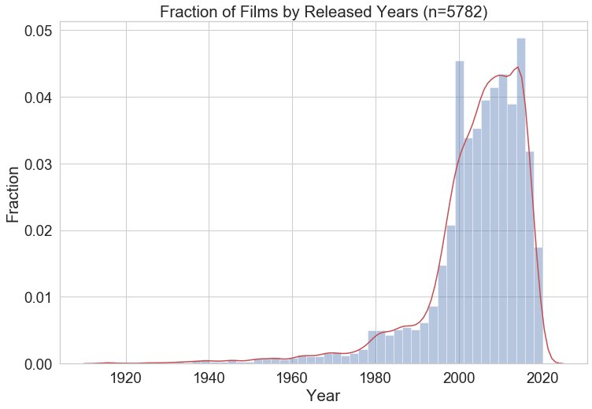


```python
# seaborn style settings
fig, ax = plt.subplots(figsize=(12,8))
sns.set_style("whitegrid")
sns.lineplot(x='year', 
             y='production_budget',
             data=group_budgets,)
sns.lineplot(x='year', 
             y='domestic_gross',
             color='g',
             data=group_budgets)
sns.lineplot(x='year', 
             y='worldwide_gross',
             color='r',
             data=group_budgets)
ylabels = ['{:,.2f}'.format(x) + 'B' for x in ax.get_yticks()/1000000000];
ax.set_yticklabels(ylabels);
ax.set(title=f'Changes in budget and gross over time (n={len(df_movie_budgets)})',
       xlabel='Year',
       ylabel='Total Amount ($)');

ax.legend(loc='upper left', labels=['Total Production Budget', 'Domestic Gross', 'Worldwide Gross'])
# source code: https://stackoverflow.com/questions/45201514/edit-seaborn-legend/45211976
```


    <matplotlib.legend.Legend at 0x1ac756eeb8>


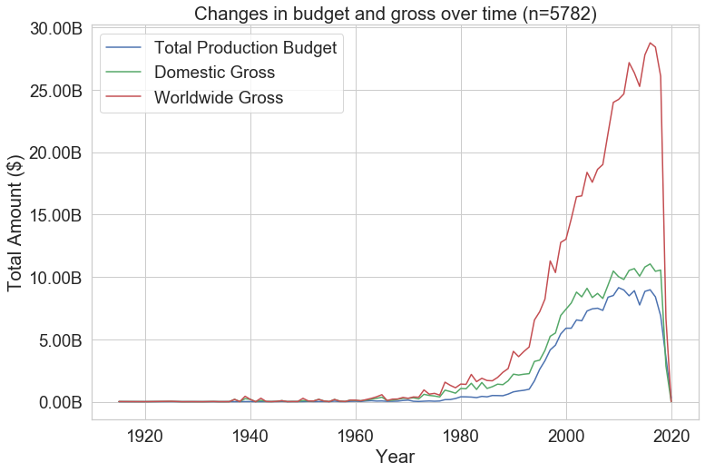


### Cleaning Data - Budget


```python
def convert_budget_category(budget):
    if budget < 200000:
        return "Ultra Low"
    elif budget < 2000000:
        return "Low"
    elif budget < 50000000:
        return "Medium"
    elif budget < 100000000:
        return "Big"
    else:
        return "Mega"
```


```python
def convert_release_date(data, col):
    data['month'] = data[col].apply(lambda x: x[:3])
    data['year'] = data[col].apply(lambda x: x[-4:]).astype('int64')

# converts currency to numeric values
def convert_currency_to_int(data, column):
    return data[column].apply(lambda x: x.replace('$',"")).apply(lambda x: x.replace(',',"")).astype('int64')

# converts multiple columns 
def convert_all_cur_to_int(data, cols):
    for col in cols:
        data[col] = convert_currency_to_int(data, col)
```


```python
# # extracts released month and year
# convert_release_date(df_movie_budgets,'release_date')

# converts currency to int
cols = ['production_budget', 'domestic_gross', 'worldwide_gross']
# convert_all_cur_to_int(sample, cols)
convert_all_cur_to_int(df_movie_budgets, cols)

# categorize budget levels
df_movie_budgets['budget_level'] = df_movie_budgets['production_budget'].apply(lambda x: convert_budget_category(x))

# percent return
df_movie_budgets['dom_percent_return'] = df_movie_budgets['domestic_gross']/df_movie_budgets['production_budget']*100
df_movie_budgets['world_percent_return'] = df_movie_budgets['worldwide_gross']/df_movie_budgets['production_budget']*100
df_movie_budgets['world_to_dom'] = df_movie_budgets['worldwide_gross'] / df_movie_budgets['domestic_gross']
```


```python
# Grouping budget info
group_budgets = df_movie_budgets.groupby('year').sum()
# df_movie_budgets.groupby('year').sum()['worldwide_gross']

group_budgets.reset_index(inplace=True)
```


```python
ax = sns.distplot(df_movie_budgets['production_budget'], )
## Useless
# sns.distplot(df_movie_budgets[df_movie_budgets['year']>=2000]['production_budget'])
# ## Useless
# sns.distplot(df_movie_budgets[df_movie_budgets['year']<2000]['production_budget'], )
# ax.set(xscale="log")
```


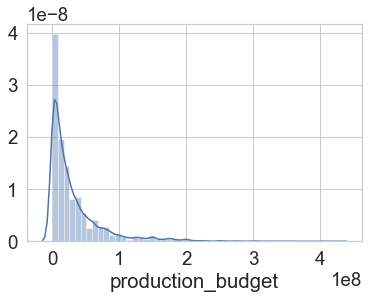


```python
# fig, axs = plt.subplots(5,2, figsize=(12, 20), facecolor='w', edgecolor='k')
# fig.subplots_adjust(hspace = .5, wspace=.001)
# axs = axs.ravel()
# year = list(range(1930,2011,10))
# for i in range(len(year)):
#     sns.distplot(df_movie_budgets[df_movie_budgets['year']>year[i]]['production_budget'], color='b', ax=axs[i])
#     ax2 = axs[i].twinx()
#     sns.distplot(df_movie_budgets[df_movie_budgets['year']<=year[i]]['production_budget'], ax=ax2, color='r')
```


```python
# mean_budget_by_year = df_movie_budgets.groupby('year').mean()['production_budget']
```


```python
# index = mean_budget_by_year.index >= 2000;
```


```python
fig, ax = plt.subplots(figsize=(12,8))
sns.set_style("whitegrid")
fig2 = sns.relplot(x="year", y="production_budget",
            kind="line", data=df_movie_budgets, ax=ax);

ylabels = ['{:,.2f}'.format(x) + 'M' for x in ax.get_yticks()/1000000];
ax.set_yticklabels(ylabels);
# Source code: https://stackoverflow.com/questions/53747298/how-to-format-seaborn-matplotlib-axis-tick-labels-from-number-to-thousands-or-mi
ax.set(title = 'Production Budget Over Time', ylabel='Production Budget ($)');

fig, ax = plt.subplots(figsize=(17,11))
sns.set_style("whitegrid")
data = df_movie_budgets[df_movie_budgets['year']>=2000]
sns.boxplot(x="year", y="production_budget", data=data, ax=ax);
ylabels = ['{:,.2f}'.format(x) + 'M' for x in ax.get_yticks()/1000000];
ax.set_yticklabels(ylabels);

plt.close(fig2.fig)
```


```python
# fig, ax = plt.subplots(figsize=(12,8))
sns.set_style("whitegrid")
fig = sns.relplot(x="year", y="production_budget",
            kind="line", hue='budget_level', 
            data=df_movie_budgets,
            height=10, aspect=2);
ax = fig.ax
ylabels = ['{:,.2f}'.format(x) + 'M' for x in ax.get_yticks()/1000000];
ax.set_yticklabels(ylabels);
# Source code: https://stackoverflow.com/questions/53747298/how-to-format-seaborn-matplotlib-axis-tick-labels-from-number-to-thousands-or-mi
ax.set(title = 'Production Budget Over Time', ylabel='Production Budget ($)');


```


```python
df_movie_budgets.columns
```


    Index(['release_date', 'movie', 'production_budget', 'domestic_gross',
           'worldwide_gross', 'month', 'year', 'budget_level'],
          dtype='object')


```python
def break_even_percentage(data=df_movie_budgets, level='Mega', world=True):
    """
    data = df_movie_budgets
    level = one of the following: ['Mega', 'Big', 'Medium', 'Low', 'Ultra Low']
    world = True, if False then 'domestic percent return'
    """
    if world:
        return_type = 'world_percent_return'
    else:
        return_type = 'dom_percent_return'
        
    sample = data[data['budget_level'] == level]
    length = len(sample)
    
    over_even = np.sum(sample[return_type] > 100)
#     print(f'There are {length} data and {over_even} broke even.')
    return over_even/length*100
```


```python
fig, axs = plt.subplots(5,2, figsize=(16,28))
fig.tight_layout(pad=2)
a = 0
for level in ['Mega', 'Big', 'Medium', 'Low', 'Ultra Low']:
    r = a//2
    for return_type in ['dom_percent_return', 'world_percent_return']:
        c = a%2
        ax = axs[r, c]
        fig = sns.distplot(df_movie_budgets[df_movie_budgets['budget_level']==level][return_type],
                  ax=ax)
        percent_over = round(break_even_percentage(df_movie_budgets, level, world=a%2),3)
        ax.axvline(100, color='r', label=f'break even\n{percent_over}%')
        ax.legend()
        ax.set(xlabel='Percent Return', ylabel='Fraction', title=f'{return_type} for {level} budget')
        a+=1

```


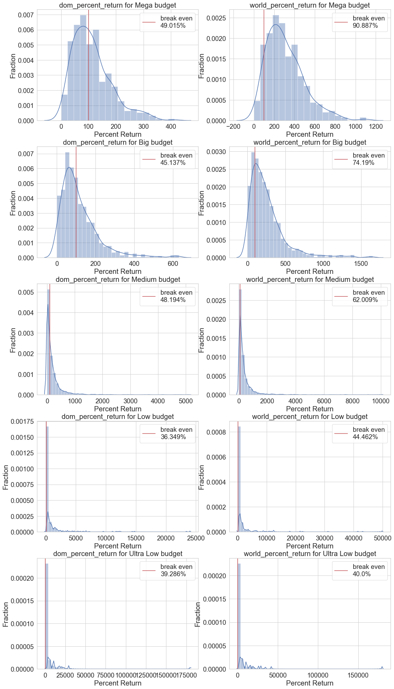


```python
fig, axs = plt.subplots(5,2, figsize=(16,28))
fig.tight_layout(pad=2)
a = 0
for level in ['Mega', 'Big', 'Medium', 'Low', 'Ultra Low']:
    r = a//2
    for return_type in ['dom_percent_return', 'world_percent_return']:
        c = a%2
        ax = axs[r, c]
        fig = sns.heatmap(df_movie_budgets[df_movie_budgets['budget_level']==level][return_type],
                  ax=ax)
        percent_over = round(break_even_percentage(df_movie_budgets, level, world=a%2),3)
        ax.axvline(100, color='r', label=f'break even\n{percent_over}%')
        ax.legend()
        ax.set(xlabel='Percent Return', ylabel='Fraction', title=f'{return_type} for {level} budget')
        a+=1

```


```python
df = df_movie_budgets.groupby(['year', 'month']).mean()['domestic_gross'].unstack()
```

### Cleaning Data - Timing


```python
# Creates 2D year vs month and its mean worldwide gross value
time_gross = df_movie_budgets[(df_movie_budgets['year']>1920) & (df_movie_budgets['year']<2020)].groupby(['year', 'month']).mean().apply(lambda x: x/1000000)['worldwide_gross'].unstack()
# corrects month order
time_gross = time_gross[['Jan', 'Feb', 'Mar', 'Apr', 'May', 'Jun', 'Jul', 'Aug', 'Sep', 'Aug', 'Oct', 'Nov', 'Dec']]
fig, ax = plt.subplots(figsize=(10,10))
sns.heatmap(time_gross, ax=ax);
ax.set(title='Mean worldwide wross in Millions');
```


```python
#Counts the number of movies from 1980 to 2020
query ="""
SELECT COUNT(*)
FROM movieBudgets
WHERE year > 1980
AND year < 2020
AND domestic_gross NOT NULL
"""
count = pd.read_sql_query(query, conn)

```


```python
# Creates 2D year vs month and its mean worldwide gross value
time_gross = df_movie_budgets[(df_movie_budgets['year']>1980) & (df_movie_budgets['year']<2020)].groupby(['year', 'month']).mean().apply(lambda x: x/1000000)['worldwide_gross'].unstack()
# corrects month order
time_gross = time_gross[['Jan', 'Feb', 'Mar', 'Apr', 'May', 'Jun', 'Jul', 'Sep', 'Aug', 'Oct', 'Nov', 'Dec']]
fig, ax = plt.subplots(figsize=(10,6))
sns.heatmap(time_gross, ax=ax);
ax.set(title=f'Mean domestic gross profit in Millions (n={count.iloc[0,0]})');
```


```python
#Counts the number of movies from 1980 to 2020
query ="""
SELECT month, AVG(domestic_gross)
FROM movieBudgets
GROUP BY month
HAVING year > 1980
AND year < 2020
AND domestic_gross NOT NULL
"""
df_dom_gross_time = pd.read_sql_query(query, conn)
df_dom_gross_time
```


<div>
<style scoped>
    .dataframe tbody tr th:only-of-type {
        vertical-align: middle;
    }

    .dataframe tbody tr th {
        vertical-align: top;
    }

    .dataframe thead th {
        text-align: right;
    }
</style>
<table border="1" class="dataframe">
  <thead>
    <tr style="text-align: right;">
      <th></th>
      <th>month</th>
      <th>AVG(domestic_gross)</th>
    </tr>
  </thead>
  <tbody>
    <tr>
      <td>0</td>
      <td>Apr</td>
      <td>2.732840e+07</td>
    </tr>
    <tr>
      <td>1</td>
      <td>Aug</td>
      <td>3.216821e+07</td>
    </tr>
    <tr>
      <td>2</td>
      <td>Dec</td>
      <td>4.610082e+07</td>
    </tr>
    <tr>
      <td>3</td>
      <td>Feb</td>
      <td>3.541465e+07</td>
    </tr>
    <tr>
      <td>4</td>
      <td>Jan</td>
      <td>2.394962e+07</td>
    </tr>
    <tr>
      <td>5</td>
      <td>Jul</td>
      <td>6.072804e+07</td>
    </tr>
    <tr>
      <td>6</td>
      <td>Jun</td>
      <td>6.582791e+07</td>
    </tr>
    <tr>
      <td>7</td>
      <td>Mar</td>
      <td>3.857299e+07</td>
    </tr>
    <tr>
      <td>8</td>
      <td>May</td>
      <td>6.669795e+07</td>
    </tr>
    <tr>
      <td>9</td>
      <td>Nov</td>
      <td>5.818117e+07</td>
    </tr>
    <tr>
      <td>10</td>
      <td>Oct</td>
      <td>2.442350e+07</td>
    </tr>
    <tr>
      <td>11</td>
      <td>Sep</td>
      <td>2.314989e+07</td>
    </tr>
  </tbody>
</table>
</div>


```python
month_dict={'Jan':1, 'Feb':2, 'Mar':3, 'Apr':4, 'May':5, 'Jun':6, 'Jul':7, 'Aug':8, 'Sep':9, 'Oct':10, 'Nov':11, 'Dec':12}
df_dom_gross_time['index'] = df_dom_gross_time['month'].apply(lambda x: month_dict[x])
```


```python
#Counts the number of movies from 1980 to 2020
query ="""
SELECT month, domestic_gross
FROM movieBudgets
WHERE year > 1980
AND year < 2020
AND domestic_gross NOT NULL
"""
df_month_dom_gross = pd.read_sql_query(query, conn)
month_dict={'Jan':1, 'Feb':2, 'Mar':3, 'Apr':4, 'May':5, 'Jun':6, 'Jul':7, 'Aug':8, 'Sep':9, 'Oct':10, 'Nov':11, 'Dec':12}
df_month_dom_gross['index'] = df_month_dom_gross['month'].apply(lambda x: month_dict[x])
df_month_dom_gross
```


<div>
<style scoped>
    .dataframe tbody tr th:only-of-type {
        vertical-align: middle;
    }

    .dataframe tbody tr th {
        vertical-align: top;
    }

    .dataframe thead th {
        text-align: right;
    }
</style>
<table border="1" class="dataframe">
  <thead>
    <tr style="text-align: right;">
      <th></th>
      <th>month</th>
      <th>domestic_gross</th>
      <th>index</th>
    </tr>
  </thead>
  <tbody>
    <tr>
      <td>0</td>
      <td>Dec</td>
      <td>760507625</td>
      <td>12</td>
    </tr>
    <tr>
      <td>1</td>
      <td>May</td>
      <td>241063875</td>
      <td>5</td>
    </tr>
    <tr>
      <td>2</td>
      <td>Jun</td>
      <td>42762350</td>
      <td>6</td>
    </tr>
    <tr>
      <td>3</td>
      <td>May</td>
      <td>459005868</td>
      <td>5</td>
    </tr>
    <tr>
      <td>4</td>
      <td>Dec</td>
      <td>620181382</td>
      <td>12</td>
    </tr>
    <tr>
      <td>...</td>
      <td>...</td>
      <td>...</td>
      <td>...</td>
    </tr>
    <tr>
      <td>5474</td>
      <td>Dec</td>
      <td>0</td>
      <td>12</td>
    </tr>
    <tr>
      <td>5475</td>
      <td>Apr</td>
      <td>48482</td>
      <td>4</td>
    </tr>
    <tr>
      <td>5476</td>
      <td>Jul</td>
      <td>1338</td>
      <td>7</td>
    </tr>
    <tr>
      <td>5477</td>
      <td>Sep</td>
      <td>0</td>
      <td>9</td>
    </tr>
    <tr>
      <td>5478</td>
      <td>Aug</td>
      <td>181041</td>
      <td>8</td>
    </tr>
  </tbody>
</table>
<p>5479 rows × 3 columns</p>
</div>


```python
fig, ax = plt.subplots(figsize=(12,8))
sns.set_style("whitegrid")
sns.barplot(x='index',
        y='domestic_gross',
        data=df_month_dom_gross)
ylabels = ['{:,.2f}'.format(x) + 'M' for x in ax.get_yticks()/1000000];
ax.set_yticklabels(ylabels);
# ax.axvline(1, color='r', linewidth=5, linestyle='--', label='Break-even line')
ax.set(title=f'Average Domestic Gross Profit by Months (n={count.iloc[0, 0]})', 
       xlabel='Month',
       ylabel='Average Domestic Gross ($)')
ax.set_xticklabels( ['Jan', 'Feb', 'Mar', 'Apr', 'May', 'Jun', 'Jul', 'Aug', 'Sep', 'Oct', 'Nov', 'Dec'], rotation=30);
```


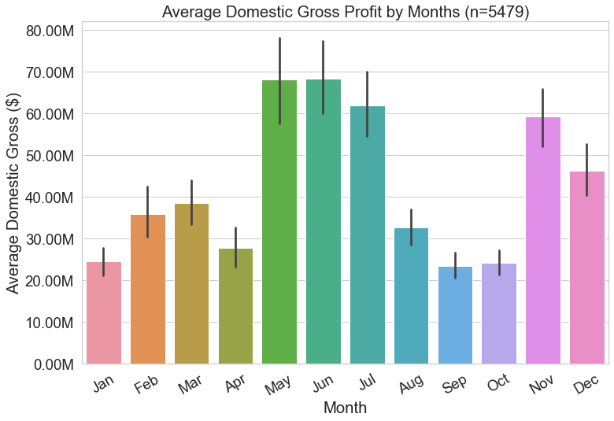


### Cleaning Data - Crew, titles, and budgets using SQLite3 and Pandas
So what do crews and percent return have in relationship?


```python
query ="""
SELECT *
FROM titleCrew
"""
pd.read_sql_query(query, conn)
```


<div>
<style scoped>
    .dataframe tbody tr th:only-of-type {
        vertical-align: middle;
    }

    .dataframe tbody tr th {
        vertical-align: top;
    }

    .dataframe thead th {
        text-align: right;
    }
</style>
<table border="1" class="dataframe">
  <thead>
    <tr style="text-align: right;">
      <th></th>
      <th>tconst</th>
      <th>directors</th>
      <th>writers</th>
    </tr>
  </thead>
  <tbody>
    <tr>
      <td>0</td>
      <td>tt0285252</td>
      <td>nm0899854</td>
      <td>nm0899854</td>
    </tr>
    <tr>
      <td>1</td>
      <td>tt0438973</td>
      <td>None</td>
      <td>nm0175726,nm1802864</td>
    </tr>
    <tr>
      <td>2</td>
      <td>tt0462036</td>
      <td>nm1940585</td>
      <td>nm1940585</td>
    </tr>
    <tr>
      <td>3</td>
      <td>tt0835418</td>
      <td>nm0151540</td>
      <td>nm0310087,nm0841532</td>
    </tr>
    <tr>
      <td>4</td>
      <td>tt0878654</td>
      <td>nm0089502,nm2291498,nm2292011</td>
      <td>nm0284943</td>
    </tr>
    <tr>
      <td>...</td>
      <td>...</td>
      <td>...</td>
      <td>...</td>
    </tr>
    <tr>
      <td>146139</td>
      <td>tt8999974</td>
      <td>nm10122357</td>
      <td>nm10122357</td>
    </tr>
    <tr>
      <td>146140</td>
      <td>tt9001390</td>
      <td>nm6711477</td>
      <td>nm6711477</td>
    </tr>
    <tr>
      <td>146141</td>
      <td>tt9001494</td>
      <td>nm10123242,nm10123248</td>
      <td>None</td>
    </tr>
    <tr>
      <td>146142</td>
      <td>tt9004986</td>
      <td>nm4993825</td>
      <td>nm4993825</td>
    </tr>
    <tr>
      <td>146143</td>
      <td>tt9010172</td>
      <td>None</td>
      <td>nm8352242</td>
    </tr>
  </tbody>
</table>
<p>146144 rows × 3 columns</p>
</div>


```python
query ="""
SELECT *
FROM titleRatings
"""
pd.read_sql_query(query, conn)
```


<div>
<style scoped>
    .dataframe tbody tr th:only-of-type {
        vertical-align: middle;
    }

    .dataframe tbody tr th {
        vertical-align: top;
    }

    .dataframe thead th {
        text-align: right;
    }
</style>
<table border="1" class="dataframe">
  <thead>
    <tr style="text-align: right;">
      <th></th>
      <th>tconst</th>
      <th>averagerating</th>
      <th>numvotes</th>
    </tr>
  </thead>
  <tbody>
    <tr>
      <td>0</td>
      <td>tt10356526</td>
      <td>8.3</td>
      <td>31</td>
    </tr>
    <tr>
      <td>1</td>
      <td>tt10384606</td>
      <td>8.9</td>
      <td>559</td>
    </tr>
    <tr>
      <td>2</td>
      <td>tt1042974</td>
      <td>6.4</td>
      <td>20</td>
    </tr>
    <tr>
      <td>3</td>
      <td>tt1043726</td>
      <td>4.2</td>
      <td>50352</td>
    </tr>
    <tr>
      <td>4</td>
      <td>tt1060240</td>
      <td>6.5</td>
      <td>21</td>
    </tr>
    <tr>
      <td>...</td>
      <td>...</td>
      <td>...</td>
      <td>...</td>
    </tr>
    <tr>
      <td>73851</td>
      <td>tt9805820</td>
      <td>8.1</td>
      <td>25</td>
    </tr>
    <tr>
      <td>73852</td>
      <td>tt9844256</td>
      <td>7.5</td>
      <td>24</td>
    </tr>
    <tr>
      <td>73853</td>
      <td>tt9851050</td>
      <td>4.7</td>
      <td>14</td>
    </tr>
    <tr>
      <td>73854</td>
      <td>tt9886934</td>
      <td>7.0</td>
      <td>5</td>
    </tr>
    <tr>
      <td>73855</td>
      <td>tt9894098</td>
      <td>6.3</td>
      <td>128</td>
    </tr>
  </tbody>
</table>
<p>73856 rows × 3 columns</p>
</div>


```python
query ="""
SELECT tconst, primary_title as title, start_year as year, runtime_minutes as runtime, genres
FROM titleBasics
"""
pd.read_sql_query(query, conn).head()
```


<div>
<style scoped>
    .dataframe tbody tr th:only-of-type {
        vertical-align: middle;
    }

    .dataframe tbody tr th {
        vertical-align: top;
    }

    .dataframe thead th {
        text-align: right;
    }
</style>
<table border="1" class="dataframe">
  <thead>
    <tr style="text-align: right;">
      <th></th>
      <th>tconst</th>
      <th>title</th>
      <th>year</th>
      <th>runtime</th>
      <th>genres</th>
    </tr>
  </thead>
  <tbody>
    <tr>
      <td>0</td>
      <td>tt0063540</td>
      <td>Sunghursh</td>
      <td>2013</td>
      <td>175.0</td>
      <td>Action,Crime,Drama</td>
    </tr>
    <tr>
      <td>1</td>
      <td>tt0066787</td>
      <td>One Day Before the Rainy Season</td>
      <td>2019</td>
      <td>114.0</td>
      <td>Biography,Drama</td>
    </tr>
    <tr>
      <td>2</td>
      <td>tt0069049</td>
      <td>The Other Side of the Wind</td>
      <td>2018</td>
      <td>122.0</td>
      <td>Drama</td>
    </tr>
    <tr>
      <td>3</td>
      <td>tt0069204</td>
      <td>Sabse Bada Sukh</td>
      <td>2018</td>
      <td>NaN</td>
      <td>Comedy,Drama</td>
    </tr>
    <tr>
      <td>4</td>
      <td>tt0100275</td>
      <td>The Wandering Soap Opera</td>
      <td>2017</td>
      <td>80.0</td>
      <td>Comedy,Drama,Fantasy</td>
    </tr>
  </tbody>
</table>
</div>


```python
query ="""
SELECT nconst, primary_name as name, known_for_titles as titles
FROM nameBasics
"""

df_names = pd.read_sql_query(query, conn)
```


```python
query ="""
SELECT movie as title, month, year, production_budget, worldwide_gross
FROM movieBudgets
"""
pd.read_sql_query(query, conn).head()
```


<div>
<style scoped>
    .dataframe tbody tr th:only-of-type {
        vertical-align: middle;
    }

    .dataframe tbody tr th {
        vertical-align: top;
    }

    .dataframe thead th {
        text-align: right;
    }
</style>
<table border="1" class="dataframe">
  <thead>
    <tr style="text-align: right;">
      <th></th>
      <th>title</th>
      <th>month</th>
      <th>year</th>
      <th>production_budget</th>
      <th>worldwide_gross</th>
    </tr>
  </thead>
  <tbody>
    <tr>
      <td>0</td>
      <td>Avatar</td>
      <td>Dec</td>
      <td>2009</td>
      <td>425000000</td>
      <td>2776345279</td>
    </tr>
    <tr>
      <td>1</td>
      <td>Pirates of the Caribbean: On Stranger Tides</td>
      <td>May</td>
      <td>2011</td>
      <td>410600000</td>
      <td>1045663875</td>
    </tr>
    <tr>
      <td>2</td>
      <td>Dark Phoenix</td>
      <td>Jun</td>
      <td>2019</td>
      <td>350000000</td>
      <td>149762350</td>
    </tr>
    <tr>
      <td>3</td>
      <td>Avengers: Age of Ultron</td>
      <td>May</td>
      <td>2015</td>
      <td>330600000</td>
      <td>1403013963</td>
    </tr>
    <tr>
      <td>4</td>
      <td>Star Wars Ep. VIII: The Last Jedi</td>
      <td>Dec</td>
      <td>2017</td>
      <td>317000000</td>
      <td>1316721747</td>
    </tr>
  </tbody>
</table>
</div>


```python
# query ="""
# SELECT primary_title as title, start_year as year,
#        runtime_minutes as runtime,
#        genres,
#        production_budget as budget,
#        domestic_gross,
#        worldwide_gross,
#        budget_level,
#        dom_percent_return,
#        world_percent_return
# FROM titleBasics as tB
# INNER JOIN movieBudgets as mB
# ON tB.primary_title = mB.movie
# """
# pd.read_sql_query(query, conn)
```


```python
query ="""
SELECT primary_title as title, start_year as year,
       runtime_minutes as runtime,
       genres,
       tC.directors,
       tC.writers,
       production_budget as budget,
       domestic_gross,
       worldwide_gross,
       budget_level,
       dom_percent_return,
       world_percent_return,
       averagerating,
       numvotes
FROM titleBasics as tB
INNER JOIN movieBudgets as mB
ON tB.primary_title = mB.movie
LEFT JOIN titleCrew as tC
ON tB.tconst = tC.tconst
LEFT JOIN titleRatings as tR
ON tB.tconst = tR.tconst
"""
# Will be using this dataframe
df = pd.read_sql_query(query, conn)
```


```python
df
```


<div>
<style scoped>
    .dataframe tbody tr th:only-of-type {
        vertical-align: middle;
    }

    .dataframe tbody tr th {
        vertical-align: top;
    }

    .dataframe thead th {
        text-align: right;
    }
</style>
<table border="1" class="dataframe">
  <thead>
    <tr style="text-align: right;">
      <th></th>
      <th>title</th>
      <th>year</th>
      <th>runtime</th>
      <th>genres</th>
      <th>directors</th>
      <th>writers</th>
      <th>budget</th>
      <th>domestic_gross</th>
      <th>worldwide_gross</th>
      <th>budget_level</th>
      <th>dom_percent_return</th>
      <th>world_percent_return</th>
      <th>averagerating</th>
      <th>numvotes</th>
    </tr>
  </thead>
  <tbody>
    <tr>
      <td>0</td>
      <td>Foodfight!</td>
      <td>2012</td>
      <td>91.0</td>
      <td>[Action, Animation, Comedy]</td>
      <td>[Lawrence Kasanoff]</td>
      <td>[Lawrence Kasanoff, Joshua Wexler, Brent V. Fr...</td>
      <td>45000000</td>
      <td>0</td>
      <td>73706</td>
      <td>Medium</td>
      <td>0.000000</td>
      <td>0.163791</td>
      <td>1.9</td>
      <td>8248.0</td>
    </tr>
    <tr>
      <td>1</td>
      <td>Mortal Kombat</td>
      <td>2021</td>
      <td>NaN</td>
      <td>[Action, Adventure, Fantasy]</td>
      <td>[Simon McQuoid]</td>
      <td>[Greg Russo]</td>
      <td>20000000</td>
      <td>70433227</td>
      <td>122133227</td>
      <td>Medium</td>
      <td>352.166135</td>
      <td>610.666135</td>
      <td>NaN</td>
      <td>NaN</td>
    </tr>
    <tr>
      <td>2</td>
      <td>The Overnight</td>
      <td>2010</td>
      <td>88.0</td>
      <td>None</td>
      <td>[Jed I. Goodman]</td>
      <td>[Kacey Arnold, Jed I. Goodman]</td>
      <td>200000</td>
      <td>1109808</td>
      <td>1165996</td>
      <td>Low</td>
      <td>554.904000</td>
      <td>582.998000</td>
      <td>7.5</td>
      <td>24.0</td>
    </tr>
    <tr>
      <td>3</td>
      <td>On the Road</td>
      <td>2012</td>
      <td>124.0</td>
      <td>[Adventure, Drama, Romance]</td>
      <td>[Walter Salles]</td>
      <td>[Jack Kerouac, Jose Rivera]</td>
      <td>25000000</td>
      <td>720828</td>
      <td>9313302</td>
      <td>Medium</td>
      <td>2.883312</td>
      <td>37.253208</td>
      <td>6.1</td>
      <td>37886.0</td>
    </tr>
    <tr>
      <td>4</td>
      <td>The Secret Life of Walter Mitty</td>
      <td>2013</td>
      <td>114.0</td>
      <td>[Adventure, Comedy, Drama]</td>
      <td>[Ben Stiller]</td>
      <td>[Steve Conrad, James Thurber]</td>
      <td>91000000</td>
      <td>58236838</td>
      <td>187861183</td>
      <td>Big</td>
      <td>63.996525</td>
      <td>206.440860</td>
      <td>7.3</td>
      <td>275300.0</td>
    </tr>
    <tr>
      <td>...</td>
      <td>...</td>
      <td>...</td>
      <td>...</td>
      <td>...</td>
      <td>...</td>
      <td>...</td>
      <td>...</td>
      <td>...</td>
      <td>...</td>
      <td>...</td>
      <td>...</td>
      <td>...</td>
      <td>...</td>
      <td>...</td>
    </tr>
    <tr>
      <td>3810</td>
      <td>Trapped</td>
      <td>2016</td>
      <td>NaN</td>
      <td>None</td>
      <td>None</td>
      <td>None</td>
      <td>30000000</td>
      <td>6916869</td>
      <td>6916869</td>
      <td>Medium</td>
      <td>23.056230</td>
      <td>23.056230</td>
      <td>NaN</td>
      <td>NaN</td>
    </tr>
    <tr>
      <td>3811</td>
      <td>The Promise</td>
      <td>2017</td>
      <td>NaN</td>
      <td>[Drama]</td>
      <td>[Edwine Dorival]</td>
      <td>[Edwine Dorival, Mackenson Dorival]</td>
      <td>90000000</td>
      <td>8224288</td>
      <td>10551417</td>
      <td>Big</td>
      <td>9.138098</td>
      <td>11.723797</td>
      <td>NaN</td>
      <td>NaN</td>
    </tr>
    <tr>
      <td>3812</td>
      <td>Sublime</td>
      <td>2019</td>
      <td>NaN</td>
      <td>[Documentary]</td>
      <td>[Bill Guttentag]</td>
      <td>[Bill Guttentag, Nayeema Raza]</td>
      <td>1800000</td>
      <td>0</td>
      <td>0</td>
      <td>Low</td>
      <td>0.000000</td>
      <td>0.000000</td>
      <td>NaN</td>
      <td>NaN</td>
    </tr>
    <tr>
      <td>3813</td>
      <td>Columbus</td>
      <td>2018</td>
      <td>85.0</td>
      <td>[Comedy]</td>
      <td>[Hatef Alimardani]</td>
      <td>[Hatef Alimardani]</td>
      <td>700000</td>
      <td>1017107</td>
      <td>1110511</td>
      <td>Low</td>
      <td>145.301000</td>
      <td>158.644429</td>
      <td>5.8</td>
      <td>5.0</td>
    </tr>
    <tr>
      <td>3814</td>
      <td>Unstoppable</td>
      <td>2019</td>
      <td>84.0</td>
      <td>[Documentary]</td>
      <td>[Nick Willing]</td>
      <td>None</td>
      <td>95000000</td>
      <td>81562942</td>
      <td>165720921</td>
      <td>Big</td>
      <td>85.855728</td>
      <td>174.443075</td>
      <td>8.1</td>
      <td>8.0</td>
    </tr>
  </tbody>
</table>
<p>3815 rows × 14 columns</p>
</div>


```python
def find_name(nconst, name_ref = dict_names):
    """
    searches for names with given nconst.
    
    nconst = name constant
    name_ref = dict_names (dictionary with all nconst values with corresponding names)
    
    """
    if nconst == None:
        return None
    
    consts = nconst.split(',')
    names = []
    for const in consts:
        try:
            names.append(dict_names[const])
        except:
            names.append(None)
    return names
```


```python
def genres_separator(genre):
    if genre == None:
        return None
    else:
        return genre.split(',')
```


```python
# converting df_name into dictionary
dict_names = dict(zip(df_names.nconst,df_names.name))
#source code: https://stackoverflow.com/questions/17426292/what-is-the-most-efficient-way-to-create-a-dictionary-of-two-pandas-dataframe-co

# replaces all the nconst in directors into actual names if not none
df['directors'] = df['directors'].apply(lambda x: find_name(x, name_ref=dict_names))

# replaces all the nconst in writers into actual names if not none
df['writers'] = df['writers'].apply(lambda x: find_name(x, name_ref=dict_names))

# seperates genres into a list
df['genres'] = df['genres'].apply(lambda x: genres_separator(x)) 
```

### Analyzing Crew members
We will now analyze what crew members, namely directors and writers, should MS hire in order to maximize ratings and return of investment.

#### Directors


```python
df_directors = df.explode('directors')

# Remove any movies without directors
df_directors = df_directors[~df_directors['directors'].isna()]


# Condense table
df_directors = df_directors[['year', 'directors', 'budget', 
                             'domestic_gross', 'worldwide_gross', 
                             'budget_level', 'dom_percent_return', 
                             'world_percent_return', 
                             'averagerating', 'numvotes']]
```


```python
# Creates sql data
df_directors.to_sql('directors', if_exists='append', con = conn)
```


```python
query ="""
SELECT directors, COUNT(*) as numFilms, SUM(budget) as total_spent, 
       SUM(domestic_gross) as total_dom, 
       SUM(worldwide_gross) as total_world,
       AVG(budget) as average_spent,
       AVG(domestic_gross) as average_dom,
       AVG(worldwide_gross) as average_world,
       CAST(AVG(domestic_gross) as FLOAT) / AVG(budget) as average_ROI_dom,
       CAST(AVG(worldwide_gross) as FLOAT) / AVG(budget) as average_ROI_world     
FROM directors AS d
GROUP BY directors
ORDER BY total_dom DESC
LIMIT 20
"""
df_directors_top = pd.read_sql_query(query, conn)

# query ="""
# SELECT directors, COUNT(*) as numFilms, SUM(budget) as total_spent, 
#        SUM(domestic_gross) as total_dom, 
#        SUM(worldwide_gross) as total_world,
#        AVG(budget) as average_spent,
#        AVG(domestic_gross) as average_dom,
#        AVG(worldwide_gross) as average_world,
#        CAST(AVG(domestic_gross) as FLOAT) / AVG(budget) as average_ROI_dom,
#        CAST(AVG(worldwide_gross) as FLOAT) / AVG(budget) as average_ROI_world     
# FROM (SELECT * FROM directors WHERE year >= 2000)
# GROUP BY directors
# ORDER BY total_dom DESC
# LIMIT 20
# """
# df_directors_top_new = pd.read_sql_query(query, conn)
```


```python
def bar_graph(data, focus='directors', hue='average'):
    """
    Graphs horizontal bar graph of 'focus' and 'hue'.
    
    data = dataframe
    
    focus = {'directors', 'genres', 'writers'}
    
    hue = {'average', 'total', 'ROI'}
    
        """
    f, ax = plt.subplots(figsize=(12, 8))

    
    if hue != 'ROI':
        if hue != 'average':
            unit = '$'
        else:
            unit = '$/movie'
            
        sns.set_color_codes("pastel")
        sns.barplot(y=f"{focus}", x=f"{hue}_world", data=data,
                    label=f"{hue} world gross", color="b")
        # Plotting average dom gross
        sns.set_color_codes("muted")
        sns.barplot(y=f"{focus}", x=f"{hue}_dom", data=data,
                    label=f"{hue} domestic gross", color="b")
        # Plot average spent (budget)
        sns.set_color_codes("muted")
        sns.barplot(y=f"{focus}", x=f"{hue}_spent", data=data,
                    label=f"{hue} spent", color="r")

        # Add a legend and informative axis label
        ax.legend(ncol=1, loc="center right", frameon=True)
        xlabels = ['{:,.2f}'.format(x) + 'B' for x in ax.get_xticks()/1000000000];
        ax.set_xticklabels(xlabels);
        ax.set(title=f'{hue} money involved for each {focus}', 
               xlabel=f'{hue} money involved ({unit})')
        sns.despine(left=True, bottom=True)
    else:
        # Plot average spent (budget)
        sns.set_color_codes("pastel")
        sns.barplot(y=f"{focus}", x="average_ROI_world", data=data,
                    label="average world ROI", color="b")

        # Plot average world gross
        sns.set_color_codes("muted")
        sns.barplot(y=f"{focus}", x="average_ROI_dom", data=data,
                    label="average domestic ROI", color="b")


        # Add a legend and informative axis label
        ax.axvline(1, color='r', linewidth=5, linestyle='--', label='Break-even line')
        ax.legend(ncol=1, loc="lower right", frameon=True)
        ax.set(title=f'ROI involved for each {focus}', 
               xlabel='ROI')
        sns.despine(left=True, bottom=True)
    return ax
```


```python
ax1 = bar_graph(data=df_directors_top, focus='directors', hue='total')

ax2 = bar_graph(data=df_directors_top, focus='directors', hue='average')

ax3 = bar_graph(data=df_directors_top, focus='directors', hue='ROI')
```


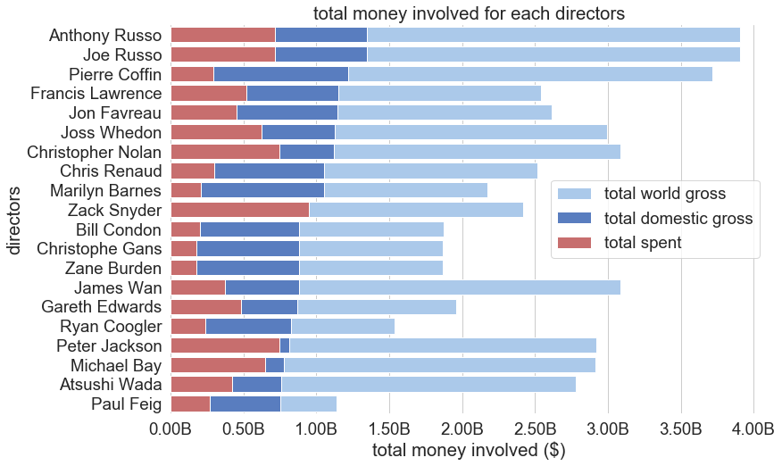


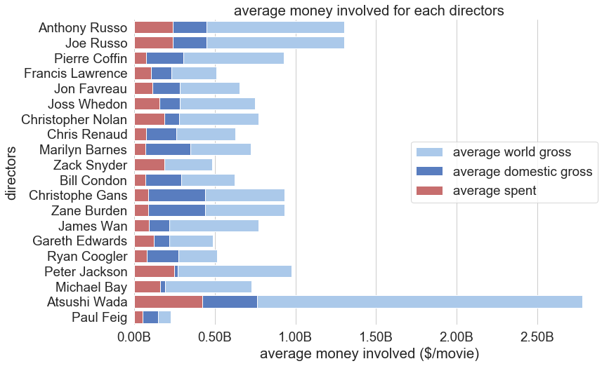


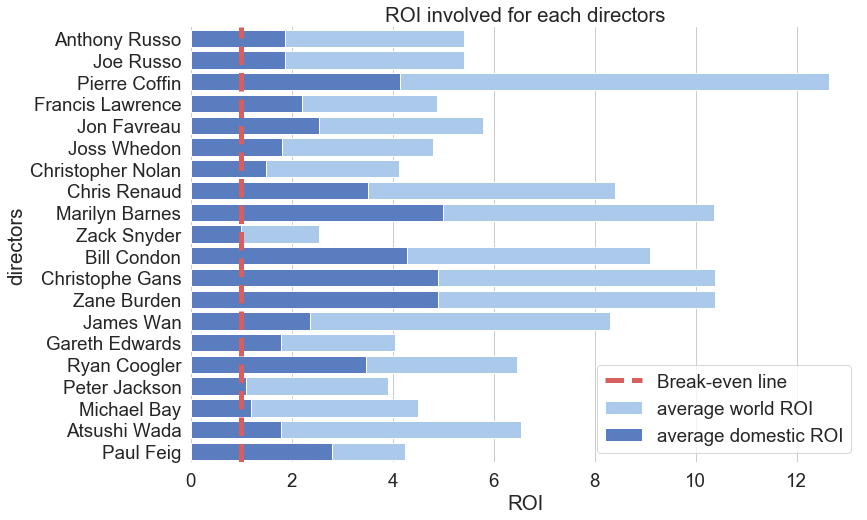


#### Writers


```python
df_writers = df.explode('writers')

# Remove any movies without writers
df_writers = df_writers[~df_writers['writers'].isna()]

# Condense table
df_writers = df_writers[['year', 'writers', 'budget', 'domestic_gross', 'worldwide_gross', 'budget_level', 'dom_percent_return', 'world_percent_return', 'averagerating', 'numvotes']]

df_writers
```


```python
# Creates sql data
df_writers.to_sql('writers', if_exists='append', con = conn)
```


```python
query ="""
SELECT writers, COUNT(*) as numFilms, SUM(budget) as total_spent, 
       SUM(domestic_gross) as total_dom, 
       SUM(worldwide_gross) as total_world,
       AVG(budget) as average_spent,
       AVG(domestic_gross) as average_dom,
       AVG(worldwide_gross) as average_world,
       CAST(AVG(domestic_gross) as FLOAT) / AVG(budget) as average_ROI_dom,
       CAST(AVG(worldwide_gross) as FLOAT) / AVG(budget) as average_ROI_world

FROM writers AS d
GROUP BY writers
ORDER BY total_dom DESC
LIMIT 20
"""
df_writers_top = pd.read_sql_query(query, conn)

```


```python
ax1 = bar_graph(data=df_writers_top, focus='writers', hue='total')

ax2 = bar_graph(data=df_writers_top, focus='writers', hue='average')

ax3 = bar_graph(data=df_writers_top, focus='writers', hue='ROI')
```


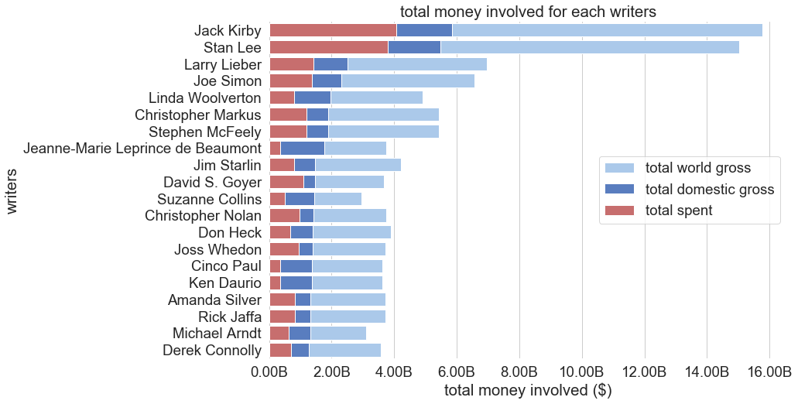


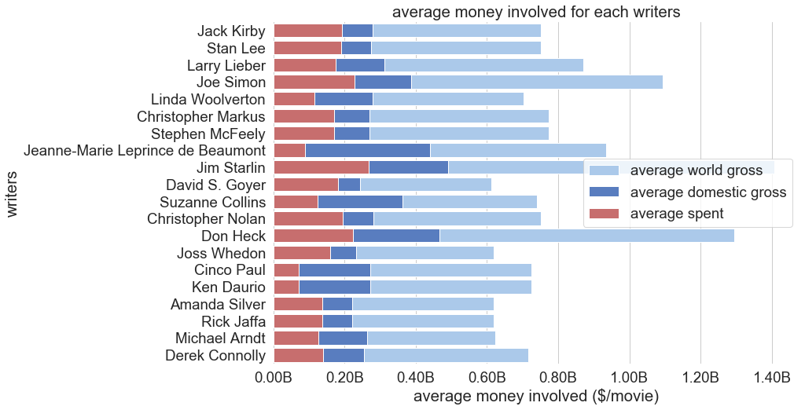


### Analyzing Genres


```python
df_genres = df.explode('genres')

# Remove any movies without genres
df_genres = df_genres[~df_genres['genres'].isna()]


# Condense table
df_genres = df_genres[['year', 'genres', 'budget', 'domestic_gross', 'worldwide_gross', 'budget_level', 'dom_percent_return', 'world_percent_return', 'averagerating', 'numvotes']]

# Creates sql data
df_genres.to_sql('genres', if_exists='append', con = conn)

```


```python
query ="""
SELECT genres, COUNT(*) as numFilms, SUM(budget) as total_spent, 
       SUM(domestic_gross) as total_dom, 
       SUM(worldwide_gross) as total_world,
       AVG(budget) as average_spent,
       AVG(domestic_gross) as average_dom,
       AVG(worldwide_gross) as average_world,
       CAST(AVG(domestic_gross) as FLOAT) / AVG(budget) as average_ROI_dom,
       CAST(AVG(worldwide_gross) as FLOAT) / AVG(budget) as average_ROI_world     
FROM genres AS d
GROUP BY genres
ORDER BY total_dom DESC
LIMIT 20
"""
df_genres_top = pd.read_sql_query(query, conn)

```


```python
ax1 = bar_graph(data=df_genres_top, focus='genres', hue='total')

ax2 = bar_graph(data=df_genres_top, focus='genres', hue='average')

ax3 = bar_graph(data=df_genres_top, focus='genres', hue='ROI')
```


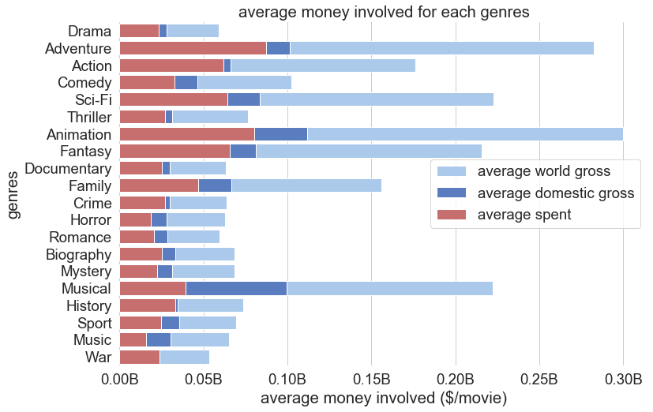


## What makes ratings higher?

### Rating vs. Production Budget


```python
query ="""
SELECT averagerating,
       numvotes,
       budget,
       domestic_gross,
       worldwide_gross,
       year,
       budget_level
FROM writers
WHERE averagerating NOT NULL
AND domestic_gross != 0


"""
df_ratings = pd.read_sql_query(query, conn)

```


```python
fig, ax = plt.subplots(figsize=(12,8))
sns.set_style("whitegrid")
sns.scatterplot(x='budget', 
                y='domestic_gross', 
                size=df_ratings['numvotes'],
                sizes=(10,500),
                hue='averagerating',
                palette="ch:2.5,-.2,dark=.3",
                data=df_ratings,
                alpha=0.7)
xlabels = ['{:,.2f}'.format(x) + 'M' for x in ax.get_xticks()/1000000];
ylabels = ['{:,.2f}'.format(x) + 'M' for x in ax.get_yticks()/1000000];

ax.set_xticklabels(xlabels);
ax.set_yticklabels(ylabels);
                   
ax.legend(loc='best', bbox_to_anchor=(1, -0.10), ncol=2)
ax.set(title='Ratings', ylabel='Average Domestic gross ($/movie)',
       xlabel='Average Budget ($/movie)');

```


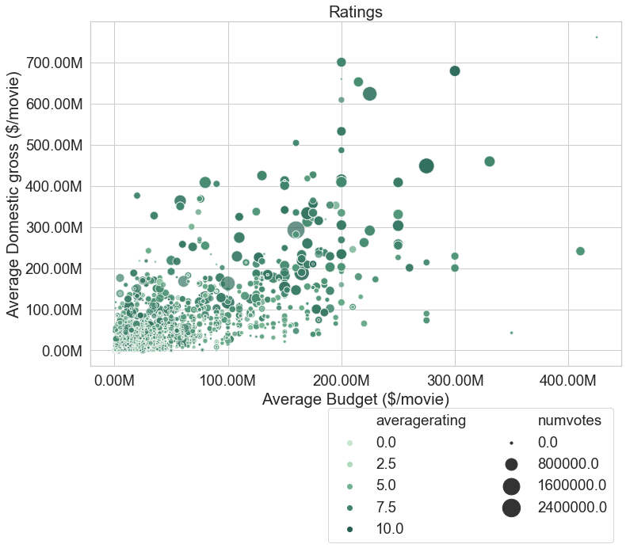


```python
# fig, ax = plt.subplots(figsize=(12,8))
sns.set_style("whitegrid")
fig = sns.relplot(x='budget',
            y='averagerating',
            data=df_ratings,
            hue='budget_level',
            kind='line',
            height=10,
            aspect=1.2)
ax = fig.ax
xlabels = ['{:,.2f}'.format(x) + 'M' for x in ax.get_xticks()/1000000];

ax.set_xticklabels(xlabels);
                   
ax.legend(loc='best', bbox_to_anchor=(1, -0.10), ncol=2)
ax.set(title='Ratings', ylabel='rating (out of 10)',
       xlabel='Average Budget ($/movie)')

```


    [Text(54.080635839120376, 0.5, 'rating (out of 10)'),
     Text(0.5, 41.03200000000004, 'Average Budget ($/movie)'),
     Text(0.5, 1, 'Ratings')]


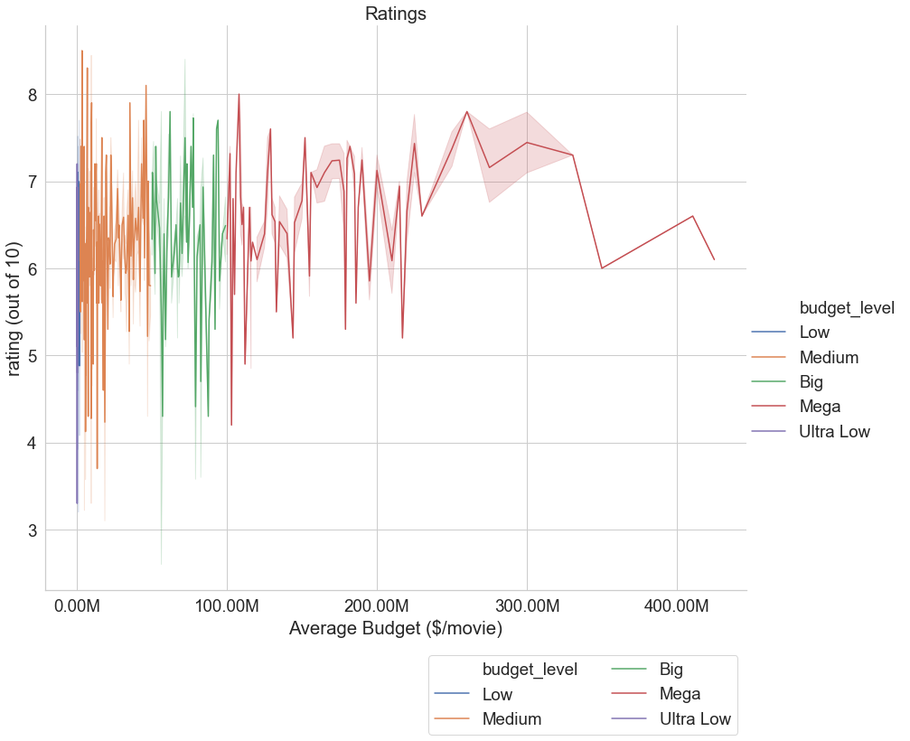


You can see that depending on the budget level the spread (standard deviation) are very different. So I will try to make violing plots to see spread of average ratings depending on their budget level. Also let's add in error bars with confidence interval of at least 95% to visually see whether these average ratings might be significantly different.


```python
# Changing budget level (categorical) to 'numerical' categorical so it arranges nicely
budget_level = {'Ultra Low': '0', 'Low':'1', 'Medium':'2', 'Big':'3', 'Mega':'4'}
df_ratings['budget_level'] = df_ratings['budget_level'].apply(lambda x: budget_level[x])
```


```python
counts = []
means = []
for level in ['0', '1', '2', '3', '4']:
    counts.append(df_ratings.groupby('budget_level').get_group(level)['averagerating'].describe()['count'])
    means.append(round(df_ratings.groupby('budget_level').get_group(level)['averagerating'].describe()['mean'],2))
```


```python
# fig, ax = plt.subplots(figsize=(12,8))
fig, ax = plt.subplots(figsize=(14,10))

sns.set(style="darkgrid", font_scale=1.7)
sns.violinplot(x='budget_level', 
               y='averagerating', 
               data=df_ratings, 
               ci=99,
               alpha=0.5, 
               ax=ax,
               palette="pastel")

fig2 = sns.relplot(x='budget_level', 
                   y='averagerating',
                   data=df_ratings, 
                   kind='line',
                   ci=95, 
                   ax=ax, 
                   color='r', 
                   linewidth=2,
                   palette='dark')
# Renaming the x-axis accordingto its budget 

ax.set_xticklabels([f'Ultra Low (<200K)\nmean={means[0]}\nn={counts[0]}', 
                    f'Low (<2M)\nmean={means[1]}\nn={counts[1]}', 
                    f'Medium (<50M)\nmean={means[2]}\nn={counts[2]}', 
                    f'Big (<100M)\nmean={means[3]}\nn={counts[3]}', 
                    f'Mega (>100M)\nmean={means[4]}\nn={counts[4]}'], 
                   rotation=30);
ax.set(title='Effect of budget on ratings', 
       ylabel='Average Rating (Out of 10)',
       xlabel='Budget Level')

plt.close(fig2.fig)

```


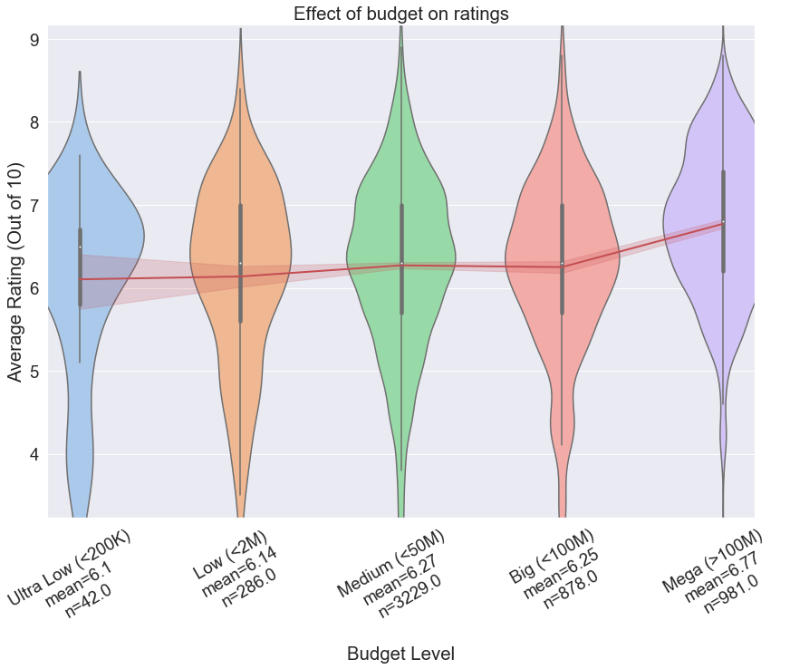


As you can see in the graphs above, higher the budget results in higher ratings significantly.

### Rating vs. top 20 writers in domestic gross


```python
query ="""
SELECT writers,
       averagerating,
       numvotes,
       budget,
       domestic_gross,
       worldwide_gross
FROM writers
WHERE writers IN (SELECT writers
FROM writers
GROUP BY writers
ORDER BY SUM(domestic_gross) DESC
LIMIT 20) 
AND averagerating NOT NULL
"""
df_ratings_by_writers = pd.read_sql_query(query, conn)
df_ratings_by_writers
```


<div>
<style scoped>
    .dataframe tbody tr th:only-of-type {
        vertical-align: middle;
    }

    .dataframe tbody tr th {
        vertical-align: top;
    }

    .dataframe thead th {
        text-align: right;
    }
</style>
<table border="1" class="dataframe">
  <thead>
    <tr style="text-align: right;">
      <th></th>
      <th>writers</th>
      <th>averagerating</th>
      <th>numvotes</th>
      <th>budget</th>
      <th>domestic_gross</th>
      <th>worldwide_gross</th>
    </tr>
  </thead>
  <tbody>
    <tr>
      <td>0</td>
      <td>Rick Jaffa</td>
      <td>7.0</td>
      <td>539338.0</td>
      <td>215000000</td>
      <td>652270625</td>
      <td>1648854864</td>
    </tr>
    <tr>
      <td>1</td>
      <td>Amanda Silver</td>
      <td>7.0</td>
      <td>539338.0</td>
      <td>215000000</td>
      <td>652270625</td>
      <td>1648854864</td>
    </tr>
    <tr>
      <td>2</td>
      <td>Derek Connolly</td>
      <td>7.0</td>
      <td>539338.0</td>
      <td>215000000</td>
      <td>652270625</td>
      <td>1648854864</td>
    </tr>
    <tr>
      <td>3</td>
      <td>Michael Arndt</td>
      <td>8.3</td>
      <td>682218.0</td>
      <td>200000000</td>
      <td>415004880</td>
      <td>1068879522</td>
    </tr>
    <tr>
      <td>4</td>
      <td>Christopher Markus</td>
      <td>6.9</td>
      <td>668137.0</td>
      <td>140000000</td>
      <td>176654505</td>
      <td>370569776</td>
    </tr>
    <tr>
      <td>...</td>
      <td>...</td>
      <td>...</td>
      <td>...</td>
      <td>...</td>
      <td>...</td>
      <td>...</td>
    </tr>
    <tr>
      <td>131</td>
      <td>Stan Lee</td>
      <td>7.1</td>
      <td>244024.0</td>
      <td>130000000</td>
      <td>216648740</td>
      <td>623144660</td>
    </tr>
    <tr>
      <td>132</td>
      <td>Larry Lieber</td>
      <td>7.1</td>
      <td>244024.0</td>
      <td>130000000</td>
      <td>216648740</td>
      <td>623144660</td>
    </tr>
    <tr>
      <td>133</td>
      <td>Jack Kirby</td>
      <td>7.1</td>
      <td>244024.0</td>
      <td>130000000</td>
      <td>216648740</td>
      <td>623144660</td>
    </tr>
    <tr>
      <td>134</td>
      <td>Jack Kirby</td>
      <td>6.0</td>
      <td>24451.0</td>
      <td>350000000</td>
      <td>42762350</td>
      <td>149762350</td>
    </tr>
    <tr>
      <td>135</td>
      <td>Stan Lee</td>
      <td>6.0</td>
      <td>24451.0</td>
      <td>350000000</td>
      <td>42762350</td>
      <td>149762350</td>
    </tr>
  </tbody>
</table>
<p>136 rows × 6 columns</p>
</div>


```python
# gives order of writers with highest average ratings
groupedvalues = df_ratings_by_writers.groupby('writers').mean().sort_values(by='averagerating', ascending=False)['averagerating']
writer_order = list(groupedvalues.index)

# gives maximum average ratings
# max_rating

groupedvalues[0]
# for x,y in enumerate(groupedvalues):
#     print(x, y)
```


```python
fig, ax = plt.subplots(figsize=(14,10))

sns.set(style="whitegrid", font_scale=1.7)
fig = sns.barplot(x='averagerating', y='writers',
            data=df_ratings_by_writers, palette='muted',
            order=writer_order)

for writer, rating in enumerate(groupedvalues):
    fig.text(rating, writer, round(rating,1), color='black', 
             ha="left", 
             fontdict={'size':17})
    
ax.axvline(groupedvalues[0], color='r', linestyle='--', linewidth=4, alpha=0.7)

ax.set(title='Average Ratings for Writers with Top 20 Domestic Gross', 
       xlabel='Average Rating (Out of 10)', ylabel='Writer')
# Ref code: https://wellsr.com/python/seaborn-barplot-tutorial-for-python/#:~:text=If%20you%20want%20to%20display,have%20to%20do%20work%20around.&text=You%20can%20see%20that%20the,be%20stored%20in%20a%20variable.
```


    [Text(0, 0.5, 'Writer'),
     Text(0.5, 0, 'Average Rating (Out of 10)'),
     Text(0.5, 1.0, 'Average Ratings for Writers with Top 20 Domestic Gross')]


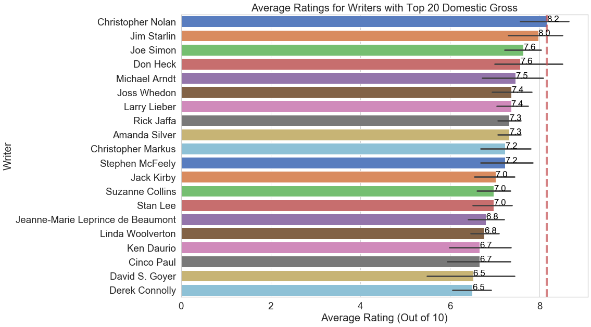


### Rating vs. top 20 directors in domestic gross


```python
query ="""
SELECT directors,
       averagerating,
       numvotes,
       budget,
       domestic_gross,
       worldwide_gross
FROM directors
WHERE directors IN (SELECT directors
FROM directors
GROUP BY directors
ORDER BY SUM(domestic_gross) DESC
LIMIT 20) 
AND averagerating NOT NULL
"""
df_ratings_by_directors = pd.read_sql_query(query, conn)
df_ratings_by_directors
```


<div>
<style scoped>
    .dataframe tbody tr th:only-of-type {
        vertical-align: middle;
    }

    .dataframe tbody tr th {
        vertical-align: top;
    }

    .dataframe thead th {
        text-align: right;
    }
</style>
<table border="1" class="dataframe">
  <thead>
    <tr style="text-align: right;">
      <th></th>
      <th>directors</th>
      <th>averagerating</th>
      <th>numvotes</th>
      <th>budget</th>
      <th>domestic_gross</th>
      <th>worldwide_gross</th>
    </tr>
  </thead>
  <tbody>
    <tr>
      <td>0</td>
      <td>Zack Snyder</td>
      <td>7.1</td>
      <td>647288.0</td>
      <td>225000000</td>
      <td>291045518</td>
      <td>667999518</td>
    </tr>
    <tr>
      <td>1</td>
      <td>Christopher Nolan</td>
      <td>8.6</td>
      <td>1299334.0</td>
      <td>165000000</td>
      <td>188017894</td>
      <td>666379375</td>
    </tr>
    <tr>
      <td>2</td>
      <td>Gareth Edwards</td>
      <td>6.4</td>
      <td>350687.0</td>
      <td>125000000</td>
      <td>136314294</td>
      <td>376000000</td>
    </tr>
    <tr>
      <td>3</td>
      <td>Gareth Edwards</td>
      <td>6.4</td>
      <td>350687.0</td>
      <td>160000000</td>
      <td>200676069</td>
      <td>529076069</td>
    </tr>
    <tr>
      <td>4</td>
      <td>Joss Whedon</td>
      <td>8.1</td>
      <td>1183655.0</td>
      <td>60000000</td>
      <td>23385416</td>
      <td>48585416</td>
    </tr>
    <tr>
      <td>...</td>
      <td>...</td>
      <td>...</td>
      <td>...</td>
      <td>...</td>
      <td>...</td>
      <td>...</td>
    </tr>
    <tr>
      <td>59</td>
      <td>Anthony Russo</td>
      <td>8.5</td>
      <td>670926.0</td>
      <td>300000000</td>
      <td>678815482</td>
      <td>2048134200</td>
    </tr>
    <tr>
      <td>60</td>
      <td>Joe Russo</td>
      <td>8.5</td>
      <td>670926.0</td>
      <td>300000000</td>
      <td>678815482</td>
      <td>2048134200</td>
    </tr>
    <tr>
      <td>61</td>
      <td>Christopher Nolan</td>
      <td>7.9</td>
      <td>466580.0</td>
      <td>150000000</td>
      <td>190068280</td>
      <td>499837368</td>
    </tr>
    <tr>
      <td>62</td>
      <td>Chris Renaud</td>
      <td>6.6</td>
      <td>3467.0</td>
      <td>80000000</td>
      <td>63795655</td>
      <td>113351496</td>
    </tr>
    <tr>
      <td>63</td>
      <td>Paul Feig</td>
      <td>6.9</td>
      <td>83338.0</td>
      <td>20000000</td>
      <td>53548586</td>
      <td>97628717</td>
    </tr>
  </tbody>
</table>
<p>64 rows × 6 columns</p>
</div>


```python
# gives order of writers with highest average ratings
groupedvalues = df_ratings_by_directors.groupby('directors').mean().sort_values(by='averagerating', ascending=False)['averagerating']
director_order = list(groupedvalues.index)

# gives maximum average ratings
# max_rating

groupedvalues[0]

```


    8.425


```python
fig, ax = plt.subplots(figsize=(14,10))

sns.set(style="whitegrid", font_scale=1.7)
fig = sns.barplot(x='averagerating', y='directors',
            data=df_ratings_by_directors, palette='muted',
            order=director_order)

for director, rating in enumerate(groupedvalues):
    fig.text(rating, director, round(rating,1), color='black', 
             ha="left", 
             fontdict={'size':17})
    
ax.axvline(groupedvalues[0], color='r', linestyle='--', linewidth=4, alpha=0.7)

ax.set(title='Average ratings for directors with Top 20 Domestic Gross', 
       xlabel='Average rating (Out of 10)', ylabel='Director')
# Ref code: https://wellsr.com/python/seaborn-barplot-tutorial-for-python/#:~:text=If%20you%20want%20to%20display,have%20to%20do%20work%20around.&text=You%20can%20see%20that%20the,be%20stored%20in%20a%20variable.
```


    [Text(0, 0.5, 'Director'),
     Text(0.5, 0, 'Average rating (Out of 10)'),
     Text(0.5, 1.0, 'Average ratings for directors with Top 20 Domestic Gross')]


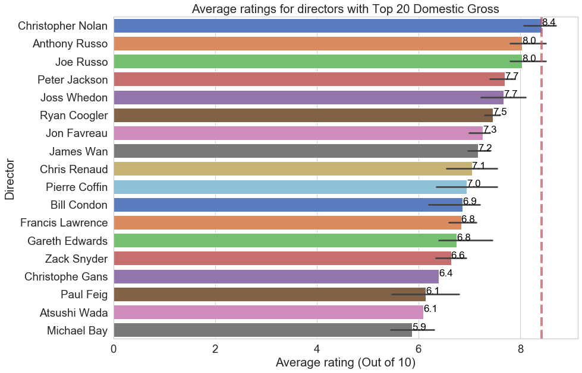


# Four Actionable Suggestions

## Action 1: Timeline
So at first, let's take a look for which month to release your future movies.


The heatmap above shows average domestic gross profits from 1980 to 2019 by months (Note that 2020 was omitted due to 1) covid-19 and 2) incomplete data). As you can see, regardless of the year, there are some clear evidence that movies that are released in summer (May-July) and winter (Nov-Dec) have higher average domestic gross profit.


The above bar graph of average domestic gross profit and we see that May-July and Nov have significantly higher average domestic gross profits.

```Suggestion: Aim for summer (May-July) or winter (Nov) to release any future movies.```

## Action 2: Budget

"A film production budget determines how much money will be spent on the entire film project. It involves the identification and estimation of cost items for each phase of filmmaking (development, pre-production, production, post-production and distribution)." - wikipedia


### Dividing budget into different levels

Due to a large range of production budgets, the films were categorized into the following depending on their production budget to reduce interference from outliers:
* Ultra-Low: < 200K USD
* Low: < 2M USD
* Medium: < 50M USD
* Big: < 100M USD
* Mega: > 100M USD
    

### Budget vs. ROI


The following can be observed from the graphs above:
* lower budget films have chance to get extremely high ROI (>1000%) but with lower chance of breaking even
* Mega budget films (>$100M)have the highest chance to break even domestically and worldwide
* International plays an important part making financial success in film industry

### Budget vs. Ratings


The graph above shows that greater the budget (notably above $100M)
    1) greater number of people vote (bigger size)
    2) higher average ratings (more green)


The above violin plot confirms that Mega-budget movies have significantly higher average ratings than lower budget movies.

```Suggestion```: Set production budget greater $100M which have
    * 49% break even chance domestically
    * 91% break even chance internationally
    * average rating of 6.77
    

## Action 3: Genre

### Genre vs. profit/ROI


From this two graphs above, we conclude that
* Drama, action, and adventure genres result in higher total domestic gross profit.
* Musical and music genres have higher ROI.
So depending on which way you want to take, there are several viable options.

```Suggestion```: 
* Drama, action, or adventure for higher profit magnitude.
* Musical or music for higher rate of return.

## Action 4: Crews

### Writers


According to the graphs above, the following conclusions could be made:
* Jack Kirby and Stan Lee produced highest total domestic profit, however they are comic book writers.
* Beaumont, Paul, and Daurio have the highest ROI.
* Christopher Nolan, Jim Starlin, and Don Heck have the highest average movie ratings.

```Suggestion```:
* For higher rating moveis, Christopher Nolan, Jim Starlin, and Don Heck are recommended.
* For higher ROI, Beaumont, Paul, and Dauiro are recommended.
* Jack Kirby and Stan Lee are out of the options since they are comic-book related writers.

### Directors


According to the graphs above, the following conclusions could be made:
* Russo brothers and Coffin produced highest total domestic profit, however they are comic book writers.
* Avoid Zack Snyder, Peter Jackson, and Michael Bay for they have the lowest ROIs.
* Christopher Nolan and the Russo brothers have the highest average movie ratings.

```Suggestion```:
* For higher rating moveis, Christopher Nolan and Russo brothers are recommended.
* In terms of ROI, we recommend avoiding Snyder, Jackson, and Bay.


# Conclusion

So in this studies, we have looked at different factors like time, production budget, genre and crew that can produce (1) high domestic gross profit, (2) high ROI and (3) high ratings.

```TIME```: 
* Aim for summer (May-July) or winter (Nov) to release any future movies.

```BUDGET```: 
* Set production budget greater $100M which have.

```GENRE```: 
* Drama, action, or adventure for higher profit magnitude.
* Musical or music for higher rate of return.

```Writer```:
* For higher rating moveis, Christopher Nolan, Jim Starlin, and Don Heck are recommended.
* For higher ROI, Beaumont, Paul, and Dauiro are recommended.
* Jack Kirby and Stan Lee are out of the options since they are comic-book related writers.

```Director```:
* For higher rating moveis, Christopher Nolan and Russo brothers are recommended.
* In terms of ROI, we recommend avoiding Snyder, Jackson, and Bay.""

# Further Studies

The following are some possibble further studies that can be done:
* More statistical analysis can be done to show significance in difference stastically.
* More data on high each films did in different countries could guide the company to strategize their marketing resources
* More data on trends could lead more valuable guidance in choosing genre, writer, director and actors/actresses

# Acknowledgement

I would like to thank Jeff Herman for taking time to review my last minute project!


```python

```
